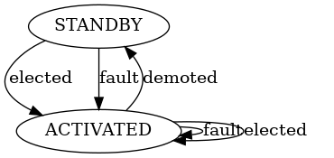

# LinK v3.0.2


> Link is not Keepalived

LinK is a networking agent that will let multiple hosts compete to get a lock on a shared resource.
This is usually a virtual IP.

LinK will perform an election between all the hosts that are sharing the same election key and then notify the winner and losers of that elections.
Depending on the Output plugin used this can then be translated to multiple actions.
The most usual action is to manage failover between hosts by moving a virtual IP or DNS domains.

The election is performed using etcd lease system and other hosts on.

When using the ARP plugin, this network is informed of the current IP owner using gratuitous ARP
requests (see [How do we bind IPs?](#how-do-we-bind-the-ips)).

To ease the cluster administration, LinK comes with it's
[own CLI](https://github.com/Scalingo/link/tree/master/cmd/link-client/).

## Demo


## Project goals

1. KISS: our goal is to follow the UNIX philosophy: "Do one thing and do it
   well". This component is only responsible of the IP attribution part. It
   will not manage load balancing or other higher level stuff.
1. At any given time on the cluster there must always be _at least one_
   server where the endpoint associated to the same election key is activated.

## Architecture

** No central manager** Each agent only have knowledge of their local
configuration. They do not know nor care if other IP exists or if other hosts
have the same IP configured. The synchronization is done by creating locks in
etcd.

** Fault resilience** If for any reason something went wrong (lost connection
with etcd) LinK will always try to have **at least** one host this means that
if one agent fails to contact the etcd cluster it will take the IP.

## Installation

In order to be able to run LinK, you must have a working etcd cluster.
Installation and configuration instructions are available on the [etcd
website](https://coreos.com/etcd/docs/latest/getting-started-with-etcd.html).

> LinK uses etcd v3 API and makes use of `LeaseValue` comparison in transactions. Hence you need etcd version 3.3.0 or higher.

The easiest way to get LinK up and running is to use pre-build binary available
on the [release pages](https://github.com/Scalingo/link/releases).

## State machine

Each LinK agent can be in any of these three states:

- `ACTIVATED`: This machine is the one holding the election key
- `STANDBY`: This machine does not own the election key but is available for election
- `FAILING`: Health checks for this host failed, this machine is not available for election
- `BOOTING`: The VIP just started to join the cluster and is waiting for an election

At any point five types of events can happen:

- `fault`: There was some error when coordinating with other nodes.
- `elected`: This machine was elected to own the election key.
- `demoted`: This machine just lost ownership of the election key.
- `health_check_fail`: The health checks configured with this endpoint failed.
- `health_check_success`: The health checks configured with this endpoint succeeded.

This is what the state machine looks like:



## Configuration

LinK configuration is entirely done by setting environment variables.

- `HOSTNAME`: Name of the host.
- `USER`: Username used for basic auth
- `PASSWORD`: Password used for basic auth
- `PORT` (default: 1313): Port where the LinK HTTP interface will be available
- `KEEPALIVE_INTERVAL`: Duration of the lease given to a VIP. If a node is down, it can take up to KEEPALIVE_INTERVAL seconds to failover.
- `KEEPALIVE_RETRY`: Number of communication errors with etcd needed before considering the etcd cluster down.
- `HEALTH_CHECK_INTERVAL`: Interval between two health check queries.
- `HEALTH_CHECK_TIMEOUT`: Max duration of a health check.
- `FAIL_COUNT_BEFORE_FAILOVER`: Number of failed health checks needed before failing over.
- `ETCD_HOSTS`: The different endpoints of etcd members
- `ETCD_TLS_CERT`: Path to the TLS X.509 certificate
- `ETCD_TLS_KEY`: Path to the private key authenticating the certificate
- `ETCD_CACERT`: Path to the CA cert signing the etcd member certificates
- `PLUGIN_ENSURE_INTERVAL`: When an endpoint is ACTIVATED, time between two run of the plugin control loop.
- `ARP_GRATUITOUS_INTERVAL`: (DEPRECATED: Use PLUGIN_ENSURE_INTERVAL)

## Endpoints

- `GET /ips`: List all currently configured IPs
- `POST /ips`: Add an IP
- `GET /ips/:id`: Get a single IP
- `DELETE /ips/:id`: Remove an IP
- `POST /ips/:id/failover`: Trigger a failover on this IP (can only be launched on the master)

## Plugins

- [ARP Plugin](plugin/arp/README.md): This plugin manages IPs and announces them on the local network using ARP.
- [Outscale Public IP Plugin](plugin/outscale_public_ip/README.md): This plugin manages the Outscale Public IPs.

## Development environment

To make it work in dev you need to create dummy interfaces which will be
manipulated by LinK to simulate failover.

The best way is to use systemd to automate this setup:

```bash
for idx in 10 11 12 13 14; do
  echo "[NetDev]
Name=eth${idx}
Kind=dummy" | sudo tee "/etc/systemd/network/10-sc-dummy-eth${idx}.netdev"
done

echo "[Match]
Name=eth1*
[Link]
ActivationPolicy=up" | sudo tee "/etc/systemd/network/11-sc-dummy-activation.network"
```

Then run `systemctl restart systemd-networkd` to activate them immediately.

If you're not using Systemd or want to do the setup manually, the script
`hacks/setup_dummy_netlink_interfaces.sh` can be executed as root to manually
create `eth10`, `eth11`, `eth13`, `eth14` and `eth15`.

## Release a New Version

Bump new version number in:

- `CHANGELOG.md`
- `README.md`

Commit, tag and create a new release:

```sh
version="3.0.2"

git switch --create release/${version}
git add CHANGELOG.md README.md
git commit --message="Bump v${version}"
git push --set-upstream origin release/${version}
gh pr create --reviewer=EtienneM --fill-first
```

Once the pull request merged, you can tag the new release.

```sh
git tag v${version}
git push origin master v${version}
```

A GitHub Action will create the release.
